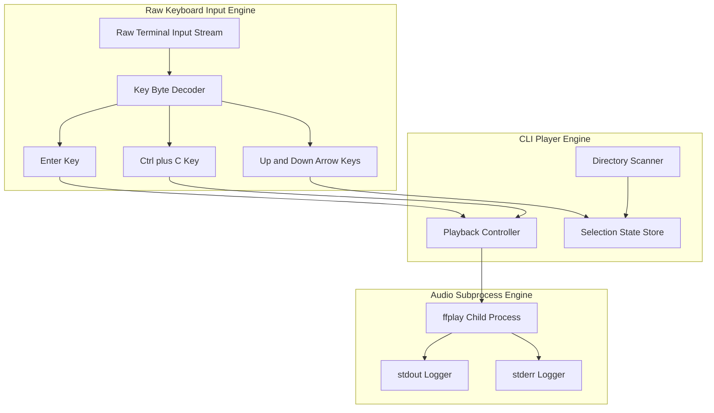
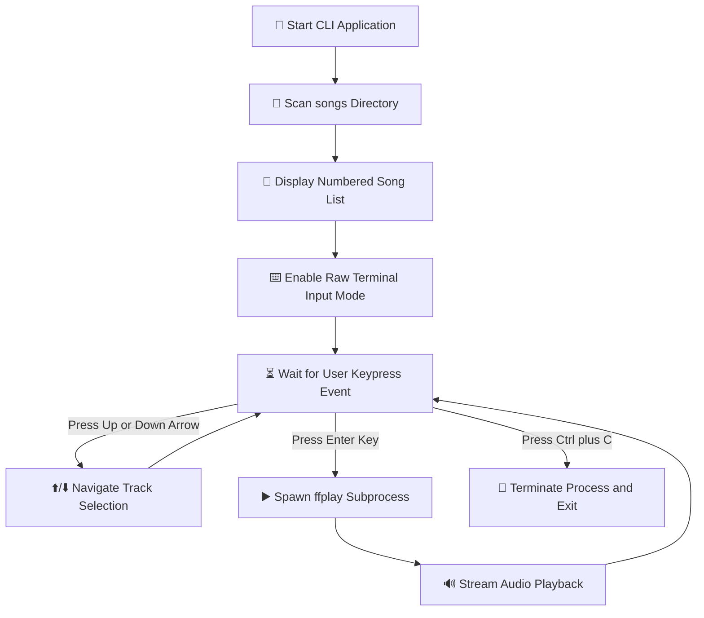

# 🎵 CLI Media Player

A lightweight, key-driven Command Line Interface (CLI) audio media player built with Node.js. It scans local audio files from the `songs/` directory and streams playback through an isolated `ffplay` subprocess, controlled using raw keyboard inputs.

---

## 🏛️ System Architecture Diagram

---

## 🔄 User Interaction Workflow Diagram

