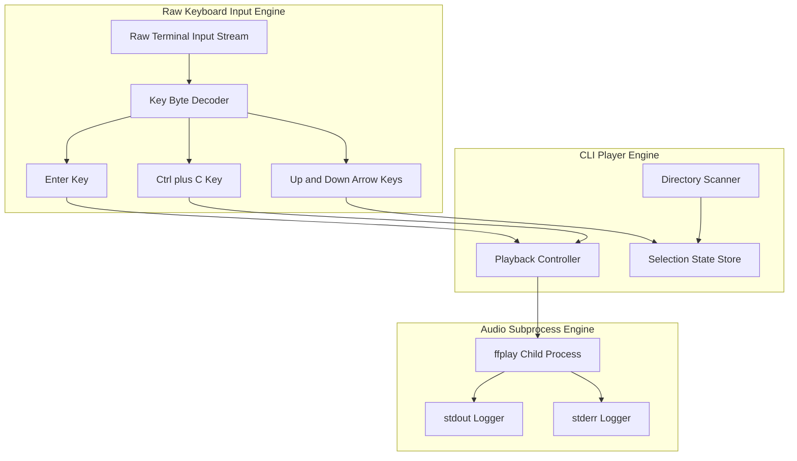
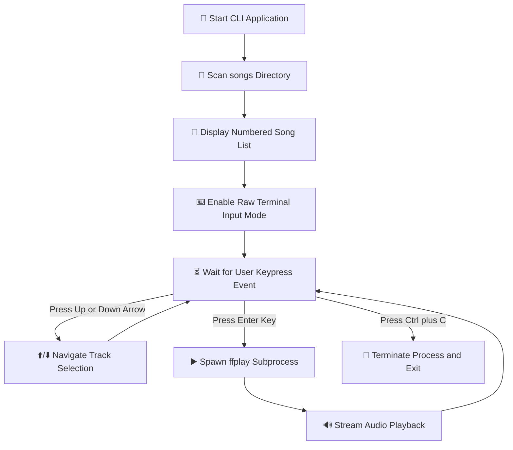

# 🎵 CLI Media Player

A lightweight, key-driven Command Line Interface (CLI) audio media player built with Node.js. It scans local audio files from the `songs/` directory and streams playback through an isolated `ffplay` subprocess, controlled using raw keyboard inputs.

---

## 🏛️ System Architecture Diagram

---

## 🔄 User Interaction Workflow Diagram

---

## What Did I Learn

Building this project was a great learning experience as this was my first time building a terminal application. I gained practical knowledge about low-level terminal I/O, process management in Node.js, ANSI escape sequences, and handling event-driven state updates.

1. **The first arrow-navigation version printed the song list again and again. Why did that happen, and how did you make the list redraw in the same place?**

   At first, standard `process.stdout.write()` was just pushing new text to the bottom of the terminal, so every update printed a whole new list. To fix this and make it redraw in place, I used ANSI escape sequences. Specifically, `\x1B[2;1H` to move the cursor back to the top of the menu, and `\r\x1B[0K` before printing each line to completely clear the old text on that line before drawing the new one.

2. **Why do we need both cursor movement and line clearing while redrawing the terminal UI? What problem can happen if you only move the cursor?**

   If you just move the cursor back up and write over the old text, you get this weird "ghosting" effect. For example, if the previous song name was really long and the new one is short, the leftover letters from the long name will still be visible at the end of the line. Clearing the line first makes sure we have a blank slate before drawing the new frame.

3. **What does the selected-song variable represent? How do you make sure the user cannot move above the first song or below the last song?**

   I used a variable called `user_input` to keep track of the index of the currently selected song in our `songs` array. To stop it from going out of bounds, I clamped the math. For moving up, I used `Math.max(0, user_input - 1)` so it never drops below 0. For moving down, I used `Math.min(songs.length - 1, user_input + 1)` so it never goes past the last index.

4. **Why was afplay + SIGSTOP/SIGCONT not a reliable solution for a real pause/resume feature? What changed in the final approach?**

   `afplay` is pretty basic and doesn't give us a clean way to pause or check exactly where the song is at. Sending `SIGSTOP` just brutally freezes the whole process at the OS level, which makes keeping track of time in our Node app a nightmare. The final approach was to switch to VLC using its Remote Control interface (`--intf rc`), which is built for this kind of stuff and can theoretically take actual commands (though for now, I'm still using SIGSTOP/SIGCONT for simplicity with VLC!).

5. **How would you prove that the pause/resume implementation is correct? Describe a small test you would perform.**

   I'd start playing a 10-second song and wait exactly 3 seconds, then hit spacebar to pause. I'd wait 5 seconds in real-time, then hit spacebar again to resume. If it's correct, the audio will pick up exactly where it left off at 3 seconds, and the progress bar won't have moved at all during those 5 seconds it was paused. It should finish playing exactly 7 seconds after I resumed it.

6. **How is the progress percentage calculated? What should happen to the progress value while the song is paused?**

   It's a simple math calculation: `(timeElapsed / totalDuration) * 100`. I get `totalDuration` once at the start using `afinfo`. I update `timeElapsed` by adding `0.1` every 100ms inside a `setInterval`, but only if `song_is_playing` is true. Because of that, when the song is paused, `timeElapsed` stops incrementing, so the progress bar automatically freezes in place.

7. **When the user starts a new song while another song is already playing, what needs to be stopped or cleaned up? What could happen if you do not do this?**

   Before starting the new song, I have to kill the existing VLC process using `player.kill("SIGTERM")` or `SIGKILL`, and also clear the old `trackingInterval`. If I forget to do this, the old VLC process keeps running in the background playing the old song, the new VLC process starts playing the new song on top of it, and multiple intervals fight to redraw the progress bar, making the terminal flicker like crazy.

8. **Describe one bug or unexpected behaviour you faced while refining this application. What did you initially think was wrong, how did you investigate it, and what was the actual fix?**

   When I implemented the progress bar, I noticed multiple intervals were running at the same time and making the timer count way too fast. I initially thought the interval delay was too small, but after looking at how I was calling `startElapsedTracking()`, I realized I wasn't clearing the old interval when a new song was played. The fix was adding a simple `if (trackingInterval) clearInterval(trackingInterval);` right before starting the new one.

9. **If you had to add "jump forward 10 seconds" next, which part of the current application would change and what existing playback information would you reuse?**

   I would capture a new keypress (like the right arrow). Since we're using VLC's `rc` interface, I'd send a seek command like `seek +10\n` directly to `player.stdin`. Then, I'd just need to manually add `10` to my `timeElapsed` variable so that the JS progress bar visually jumps forward and stays perfectly in sync with the audio.
