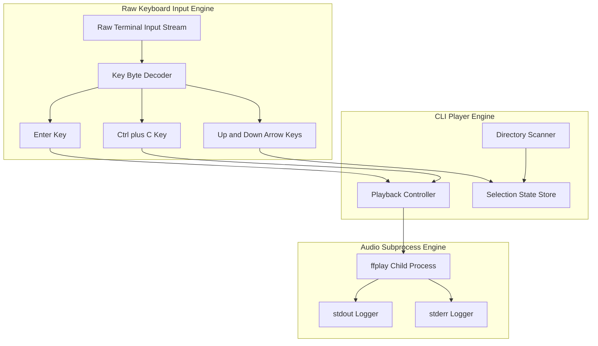
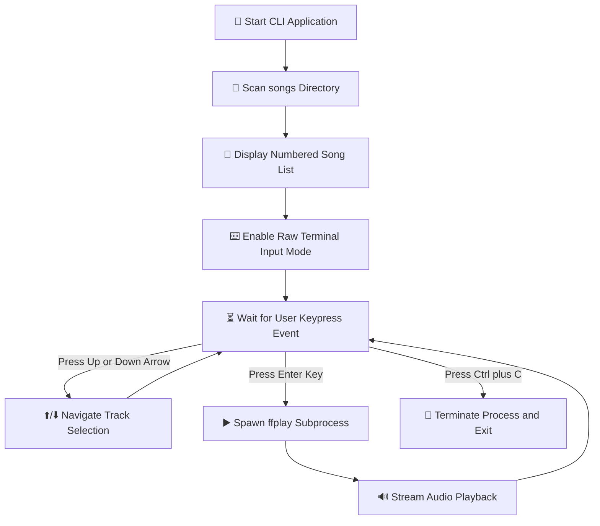

# 🎵 CLI Media Player

A lightweight, key-driven Command Line Interface (CLI) audio media player built with Node.js. It scans local audio files from the `songs/` directory and streams playback through an isolated `ffplay` subprocess, controlled using raw keyboard inputs.

---

## 🏛️ System Architecture Diagram

---

## 🔄 User Interaction Workflow Diagram

---

## 💡 Key Learnings & Questionnaire

### 1. In-Place Terminal Redrawing
**Q: The first arrow-navigation version printed the song list again and again. Why did that happen, and how did you make the list redraw in the same place?**  
At first, standard `process.stdout.write()` was just pushing new text to the bottom of the terminal, so every update printed a whole new list. To fix this and make it redraw in place, ANSI escape sequences can be used. Specifically, `\x1B[2;1H` to move the cursor back to the top of the menu, and `\r\x1B[0K` before printing each line to completely clear the old text on that line before drawing the new one.

### 2. Cursor Movement & Line Clearing
**Q: Why do we need both cursor movement and line clearing while redrawing the terminal UI? What problem can happen if you only move the cursor?**  
If you just move the cursor back up and write over the old text, you get a "ghosting" effect. For example, if the previous song name was really long and the new one is short, the leftover letters from the long name will still be visible at the end of the line. Clearing the line first makes sure we have a blank slate before drawing the new frame.

### 3. Navigation Bounds & Selection State
**Q: What does the selected-song variable represent? How do you make sure the user cannot move above the first song or below the last song?**  
A variable called `user_input` keeps track of the index of the currently selected song in the `songs` array. To stop it from going out of bounds, math clamping is used:
- **Moving Up:** `Math.max(0, user_input - 1)` so it never drops below 0.
- **Moving Down:** `Math.min(songs.length - 1, user_input + 1)` so it never goes past the last index.

### 4. Audio Engine & Control Mechanisms
**Q: Why was `afplay` + `SIGSTOP`/`SIGCONT` not a reliable solution for a real pause/resume feature? What changed in the final approach?**  
`afplay` is pretty basic and doesn't give a clean way to pause or check exactly where the song is at. Sending `SIGSTOP` just brutally freezes the whole process at the OS level, which makes keeping track of time in a Node app a nightmare. The final approach switched to VLC using its Remote Control interface (`--intf rc`), which is built for process communication and can take standard control commands.

### 5. Verifying Pause & Resume Behavior
**Q: How would you prove that the pause/resume implementation is correct? Describe a small test you would perform.**  
Start playing a 10-second song and wait exactly 3 seconds, then hit spacebar to pause. Wait 5 seconds in real-time, then hit spacebar again to resume. If correct, the audio will pick up exactly where it left off at 3 seconds, and the progress bar won't have moved at all during those 5 seconds it was paused. It should finish playing exactly 7 seconds after resuming.

### 6. Progress Calculation & Tracking
**Q: How is the progress percentage calculated? What should happen to the progress value while the song is paused?**  
Progress is calculated as `(timeElapsed / totalDuration) * 100`. `totalDuration` is fetched once at the start using `afinfo`. `timeElapsed` is updated by adding `0.1` every 100ms inside a `setInterval`, but only if `song_is_playing` is true. When the song is paused, `timeElapsed` stops incrementing, so the progress bar automatically freezes in place.

### 7. Process Cleanup & Resource Management
**Q: When the user starts a new song while another song is already playing, what needs to be stopped or cleaned up? What could happen if you do not do this?**  
Before starting a new song, the existing VLC process must be terminated using `player.kill("SIGTERM")` or `SIGKILL`, and the old `trackingInterval` must be cleared. If not done, the old VLC process keeps running in the background playing the old song, the new VLC process starts playing the new song on top of it, and multiple intervals fight to redraw the progress bar, causing screen flickering.

### 8. Debugging Story: Multiple Progress Intervals
**Q: Describe one bug or unexpected behavior you faced while refining this application. What did you initially think was wrong, how did you investigate it, and what was the actual fix?**  
When implementing the progress bar, multiple intervals were running simultaneously and causing the timer to count way too fast. Initially, the interval delay seemed to be too small, but investigation into `startElapsedTracking()` revealed that the old interval wasn't being cleared when a new song was played. The fix was adding `if (trackingInterval) clearInterval(trackingInterval);` right before starting the new tracking timer.

### 9. Extending Functionality: 10-Second Jump
**Q: If you had to add "jump forward 10 seconds" next, which part of the current application would change and what existing playback information would you reuse?**  
Capture a new keypress (like the right arrow key). Since VLC's `rc` interface is used, send a seek command like `seek +10\n` directly to `player.stdin`. Then, manually add `10` to the `timeElapsed` variable so that the JS progress bar visually jumps forward and stays in sync with the audio.

