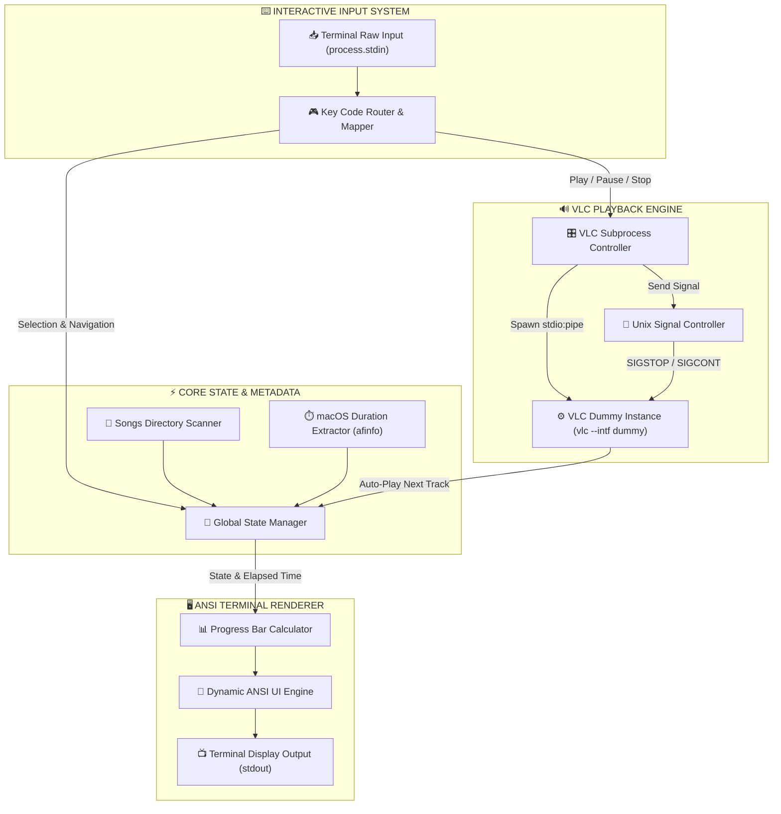
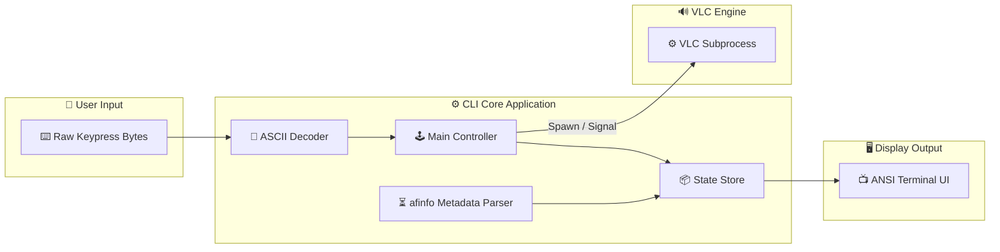
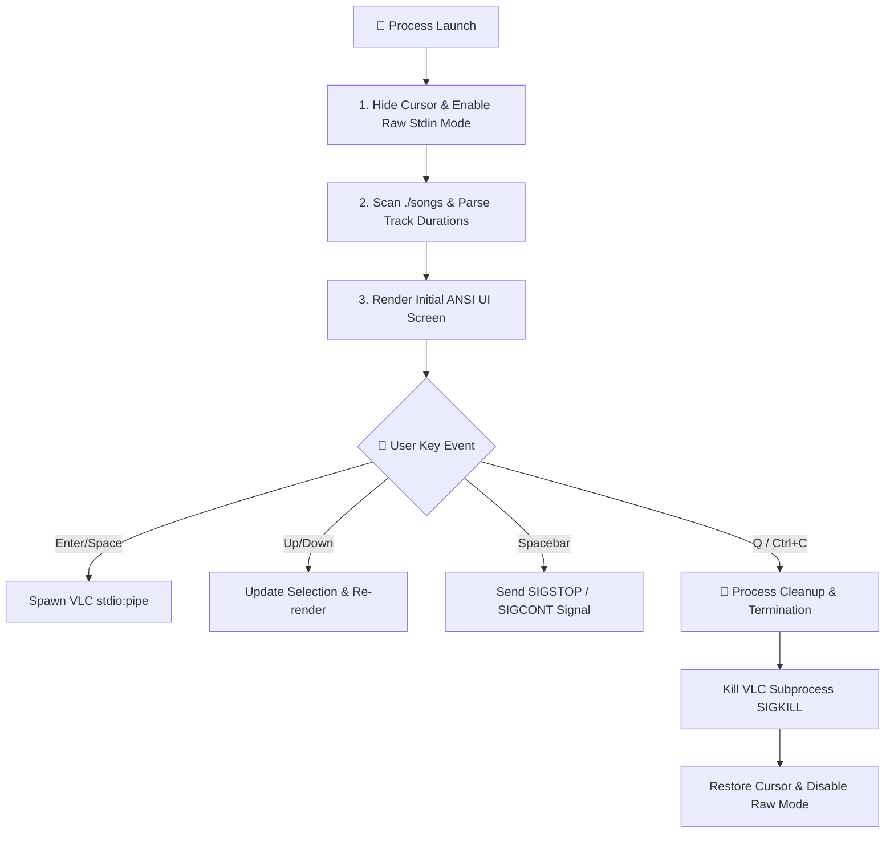

# 🎵 Node.js CLI Media Player — System Architecture

A lightweight, zero-dependency Node.js command-line interface (CLI) media player powered by VLC dummy mode, Apple `afinfo` track duration parsing, zero-flicker ANSI rendering, and raw terminal keyboard controls.

---

## 🏛️ System Architecture (Mermaid Diagram)



---

## 🔄 Component Data Flow Architecture



---

## 🎨 Interactive Terminal UI Preview

```
=====================================================
           🎵  NODE.JS CLI MEDIA PLAYER  🎵          
=====================================================

  AUDIO LIBRARY (4 Tracks):
  ---------------------------------------------------
     ▶ [01] Chris Brown, Tyga - Girl You Loud.mp3
   > ⏸ [02] OneRepublic - Sunshine.mp3
     [03] Samuel Kim & Lorien - I Really Want to Stay at Your House.mp3
     [04] Wuthering Waves, Tarokiki - Voyaging Star's Farewell.mp3
  ---------------------------------------------------

  CURRENT PLAYBACK:
  Track  : OneRepublic - Sunshine.mp3
  Status : [PAUSED]
  Progress: [███████████████░░░░░░░░░░░░░░░] 50.0% (01:21 / 02:42)

=====================================================
Controls: [↑/↓/k/j] Nav | [Enter] Play | [Space] Pause/Play | [S] Stop | [Q] Quit
```

---

## 🛠️ Subsystem Technical Specifications

> [!NOTE]
> All core functions operate natively using Node.js standard libraries (`child_process`, `fs`, `path`) without third-party npm dependencies.

### 1️⃣ Audio Directory Scanner
- **Path:** `./songs` relative to execution root.
- **Filtering Rule:** Ignores dotfiles (`.DS_Store`) and keeps supported extensions (`.mp3`, `.m4a`, `.wav`, `.flac`, `.aac`, `.ogg`).
- **Sorting:** Alphanumeric natural sort order.

### 2️⃣ Metadata Extractor (`afinfo`)
- **Utility:** Apple File Info (`afinfo`)
- **Execution:** Async `execFile('afinfo', [filePath])`
- **Regex Extraction:**
  $$\text{duration} = \text{parseFloat}(\text{stdout.match}(/\text{estimated duration: }([\d.]+)\text{ sec}/i)[1])$$
- **Cache:** In-memory `Map<string, number>` prevents duplicate process spawns.

### 3️⃣ VLC Subprocess Engine
- **Command Flags:** `vlc --intf dummy --play-and-exit <filepath>`
- **Standard I/O:** `stdio: 'pipe'` completely isolates VLC standard output.
- **Process Signals:**
  - `SIGSTOP`: Suspends child process (Pause).
  - `SIGCONT`: Resumes child process (Resume).
  - `SIGKILL`: Kills process on track change or exit.

### 4️⃣ Keyboard Raw Mode Mapping

| Key Input | ASCII Code | Trigger Action |
| :--- | :--- | :--- |
| `Spacebar` | `32` | Toggle Play / Pause |
| `Enter` | `13` / `10` | Play Selected Track |
| `Up Arrow` / `k` | `27 91 65` / `107` | Navigate Up |
| `Down Arrow` / `j` | `27 91 66` / `106` | Navigate Down |
| `S` / `s` | `115` / `83` | Stop Playback |
| `Q` / `q` / `Ctrl+C` | `113` / `81` / `3` | Clean Quit & Restore Terminal |

---

## ⚡ Signal & Process Lifecycle Workflow


